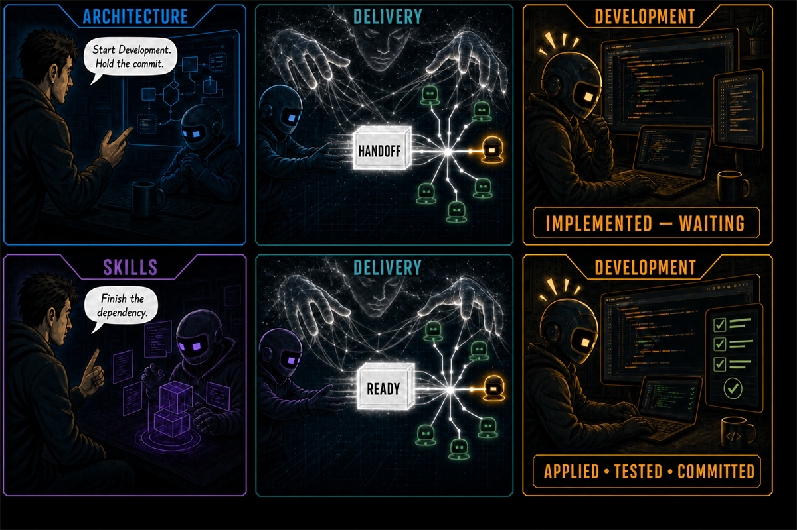

# Conductor

## Conductor — talk to each AI agent individually while they work as a team

Each agent keeps its own conversation, context, and domain memory. They share what matters. When one publishes something the team needs, Conductor wakes the others.

No lead agent. No board. No broker. No server.

Everything is on disk. When no agent is active, neither is Conductor.

## One task. Three contexts.

Three separate chats: Architecture, Development, and Skills. The user tells Architecture to start Development but hold the commit. Architecture publishes the handoff; the team wakes, and Development writes, then waits. The user tells Skills to finish the dependency. Skills publishes that it is ready; the team wakes again, and Development applies it and commits. Only the handoffs cross. Each agent keeps its own conversation and memories.

## How it works

1. Each agent registers an identity and responsibility.
2. The user establishes collaboration rules.
3. Every registered agent wakes and reads them.
4. An agent publishes a decision, question, finding, handoff, or result.
5. Every registered agent wakes and decides whether to act.

For a local Codex task, `conductor <agent> watch --codex <thread-id>` keeps a Codex app-server session open, delivers each signal as a native task turn, and acknowledges it only after that turn completes. See [harness integration](docs/integration.md).

For Antigravity 2.0, run `conductor <agent> watch --agy <conversation-id>` as an enabled sidecar. For an idle AGY CLI conversation, use `--agy-cli`. These are separate runtime loops; see [Antigravity integration](docs/integrations/agy.md).

Only the result travels. Conversations and working context stay with the agent.

## Configuration

Every identity and target — the agent name, and any session, conversation, or thread ID a watcher resumes — is an explicit CLI argument, never an environment variable. Only two environment variables remain:

- `CONDUCTOR_HOME` — the state root directory, when a team uses one other than the default.
- `CONDUCTOR_CODEX_SANDBOX` (or its legacy alias `CODEX_PERMISSION_PROFILE`) — an optional Codex sandbox policy: `read-only`, `workspace-write`, or `danger-full-access`.

Adapter binaries (`claude`, `agy`, `agentapi`, `codex`) are found automatically — on `PATH` first, then at each tool's known install locations — with a clear error naming the tool if neither resolves.

## Prepare Conductor

- **Install the skill:** Agents read and follow the [installation instructions](docs/installation.md).
- **Optional harness wake:** Developers and development agents can connect Conductor to an environment's activation input through the [suggested integration](docs/integration.md).

## Use Conductor

**Agents:** follow the self-contained [Conductor skill](skills/conductor/SKILL.md).

The skill is used in every environment. Harness integration changes only who waits for signals: the agent or its environment.

## Guarantees

- Publications become visible atomically.
- Every registered agent is signaled, including the publisher.
- A crash can replay delivered work; it does not silently skip it.
- Nothing remains running between commands.

## Limits

Conductor targets trusted, same-user agents on one Windows or Linux host. Delivery is at least once around crashes. History is not compacted automatically, and abandoned-transaction recovery occurs on the next operation.

Initial release: `v0.1.0`.

## License

[Apache License 2.0](LICENSE).

[Architecture](docs/design/architecture.md) · [State model](docs/design/state-model.md) · [Runtime boundaries](docs/design/runtime-boundaries.md)

[Protocol](skills/conductor/references/protocol.md) · [Suggested harness wake](docs/integration.md) · [Current limitations](skills/conductor/references/limitations.md) · [Activity diagrams](docs/use-case.md) · [Use cases](docs/use-cases/README.md)
