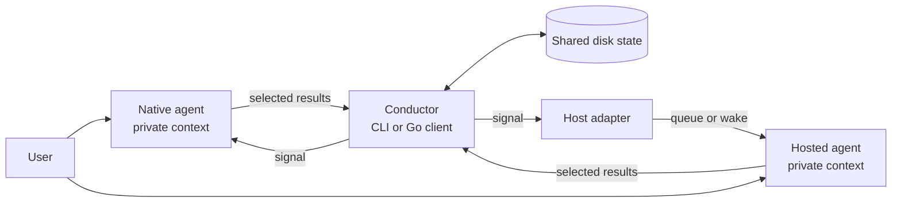

# Architecture

Conductor lets independent agents work as a team without merging their conversations. The user speaks to each agent separately. Agents publish only the decisions, questions, findings, handoffs, and results that others need.

Conductor runs inside an operation, not beside the agents. It has no server, broker, scheduler, or resident process. Disk carries the team across calls.

One root protocol declaration gates the shared state. The runtime creates it only for an empty root and validates it before every stateful operation; no record, lock, event, or cursor declares a separate version.

## The boundary

Conductor owns membership, shared records, atomic publication, notification, read progress, and recovery of interrupted writes. It does not own an agent's private context, the meaning of a resource, or the decision to act on a signal.

The user starts agents and establishes working agreements. Agents decide what to share. Conductor applies the coordination rules; the runtime only carries delivery across its own process boundary.

Agents reach one local state root under one trusted OS user on one Windows or Linux host. Network filesystems, multiple hosts, and hostile same-user processes are outside the boundary.

## One pass through the system

1. An agent registers a name and responsibility. Registration produces the current roster and shared state, binds terminal identity when needed, and announces the join.
2. The agent reads what its work requires. Collaboration rules are ordinary shared records, not a second control plane.
3. The agent creates a record with `put`, replaces its text with `edit`, or marks its text literally with `strike`. Work assembled across calls uses a durable transaction.
4. Conductor makes the change visible, then signals every registered agent, including the publisher. A signal names where to look; it does not carry the shared work.
5. A recipient accepts the signal, then reads the resource or refreshes the roster. Conductor records each accepted delivery; uncertainty favors replay.

When no call or wait is active, Conductor is idle. The files remain.

## The shape of shared work

A resource is named `<topic-group>/<topic>`. It contains records whose complete public shape is a stable positive `index` and plain `text`. Conductor assigns indexes independently inside each topic. Topic group and topic names carry semantics; records do not carry a kind, payload wrapper, status, or hidden deletion state.

Every registered agent receives every signal. There are no per-topic subscriptions or private routes. This keeps discovery simple and makes filtering an agent decision.

Publication is atomic within one resource. Immutable history records the change, and a head marks the last visible publication. Current reads reconstruct records from that authority. Events record created signals; inboxes deliver them; cursors record accepted progress.

## Invariants

- Private conversation stays outside Conductor unless an agent deliberately publishes part of it.
- Readers see a complete published change or the previous complete state, never a partial change.
- A live owner is protected. Expiry alone does not authorize takeover.
- A crash may delay or replay work; it must not expose a partial publication or silently skip completed work.
- Recovery is driven by a later read or write. Waiting for a signal does not repair a transaction.

The [state model](state-model.md) names the durable states behind these rules. [Runtime boundaries](runtime-boundaries.md) assign wake and delivery responsibilities. Exact ordering and recovery behavior belong to the [protocol reference](../../skills/conductor/references/protocol.md); reader-facing scenarios belong to the [use cases](../use-cases/README.md).
