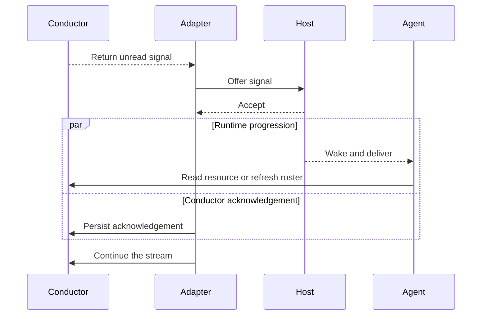

# Runtime boundaries

Conductor can wait for activity, but it cannot decide how an agent process should wake. That boundary belongs to the environment running the agent.

The properties either side owns are different in kind. Conductor owns **reachability**: a publication lands, persists, and is waiting whenever an agent next looks. The host owns **wakeability**: whether that arrival starts a turn. Reachability is a durability guarantee and holds unconditionally; wakeability is a liveness guarantee and is what an adapter exists to supply.

## The split

| Responsibility | Owner |
| --- | --- |
| Wait operation | Conductor — one continuous delivery stream, identical on every host |
| Holding the stream open | The adapter's resident component, kept alive by the host |
| Delivery channel | The host's message, event, or wake input |
| Acceptance point | The host accepts the delivery |
| Restoration after an interruption | The adapter, through its host's lifecycle and turn-boundary events |

The agent participates in none of it. It joins, reads, publishes, and leaves; it does not establish, hold, or restore delivery. Conductor supplies the wait and acknowledgement primitives and one adapter per supported host; it does not ship a universal adapter, because the triggering step has no host-neutral form.

An agent with no live process cannot be woken at all. That is a physical limit, not a design choice, and the system's obligation is to report it plainly rather than present a closed agent as present. Everything published meanwhile is intact and waiting.

## The acceptance boundary

Acceptance and acknowledgement are not atomic. If the handoff fails before acceptance, the signal stays unread. If acknowledgement is interrupted after acceptance, Conductor may replay it. Once acknowledgement persists, scheduling and execution are runtime-owned.

By default, `--mode=content` resolves the resource delta or roster before delivery and acknowledges both the signal and that read after successful output. `--mode=summary` returns only the location and leaves the awakened agent to read it. Shared state stays authoritative either way; the mode changes who performs the read, not what is authoritative.

## Identity across the boundary

SDK callers and CLI calls alike provide an agent identity explicitly, as the leading argument to every command.

An adapter cannot supply that argument by asking the agent, since it acts without the agent's participation. It resolves the identity from configuration the session carries. The runtime owns the mapping from Conductor identity to host session; Conductor verifies membership and does not choose which conversation, queue, or worker represents that identity.

## Liveness and failure

"No resident Conductor process" does not mean nothing blocks. An adapter's resident component stays active while waiting, but the core has no independent daemon once that caller exits.

Cancellation ends the current wait without acknowledging a signal. The SDK-only `WatchSinceContext` operation is not a retry tool: it deliberately discards signals through a chosen index. Transaction recovery is also outside the wake path; only a later resource read or write can recover an expired dead owner.

Host-specific policy remains outside this repository: adapter lifetime, durable session mapping, retry after host acceptance, and behavior when an accepted trigger never reaches an agent.

Practical adapter guidance lives in [host adapters](../integration.md) and the [adapter registry](../integrations/README.md). Native operating instructions live in the [Conductor skill](../../skills/conductor/SKILL.md). The [state model](state-model.md) defines delivery progress; the [protocol reference](../../skills/conductor/references/protocol.md) owns exact acknowledgement behavior.
