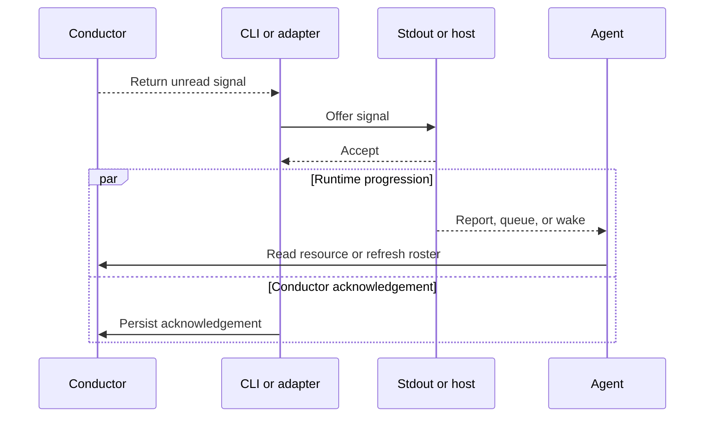

# Runtime boundaries

Conductor can wait for activity, but it cannot decide how an agent process should wake. That boundary belongs to the environment running the agent.

Native agents and hosted agents use the same signal and acknowledgement contract. They differ in who owns the wait loop and where acceptance occurs.

## Two delivery paths

| Responsibility | Native terminal or app | Hosted SDK or harness |
| --- | --- | --- |
| Wait owner | The agent or its native host | A host-specific adapter |
| Wait operation | Runtime-selected CLI watch or native channel | One `WatchContext` call for the target identity |
| Delivery channel | Managed completion or the selected native adapter | The host's message, event, or wake input |
| Acceptance point | Successful stdout output or adapter delivery | The host accepts the trigger input |
| Next wait | The agent rearms, or its native host schedules the next check | The adapter starts it after delivery is accepted |

On the native path, the skill invokes the CLI installed beside it by absolute path. The runtime-specific integration decides whether that call blocks, polls, or uses a native channel. See the integration matrix for the supported command and lifecycle.

A hosted agent does not call `watch`. The adapter waits, maps the Conductor identity to a host session, submits the signal through the host's normal trigger path, acknowledges acceptance, and waits again. The agent still uses the skill to join, read, publish, and leave. Conductor supplies the wait and acknowledgement primitives; it does not ship a universal harness adapter.

## The acceptance boundary

Acceptance and acknowledgement are not atomic. If the handoff fails before acceptance, the signal stays unread. If acknowledgement is interrupted after acceptance, Conductor may replay it. Once acknowledgement persists, scheduling and execution are runtime-owned.

By default, `--mode=content` resolves the resource delta or roster before delivery and acknowledges both the signal and that read after successful output. `--mode=summary` returns only the location and leaves the awakened agent to read it. Shared state stays authoritative either way; the mode changes who performs the read, not what is authoritative.

## Identity across the boundary

SDK callers and CLI calls alike provide an agent identity explicitly, as the leading argument to every command. There is no environment variable or terminal-session binding that supplies it implicitly.

The runtime owns the mapping from Conductor identity to host session. Conductor verifies membership; it does not choose which conversation, queue, or worker represents that identity.

## Liveness and failure

"No resident Conductor process" does not mean every integration blocks. A native watch call or hosted adapter may remain active while waiting, but the core has no independent daemon once that caller exits.

Cancellation ends the current wait without acknowledging a signal. The SDK-only `WatchSinceContext` operation is not a retry tool: it deliberately discards signals through a chosen index. Transaction recovery is also outside the wake path; only a later resource read or write can recover an expired dead owner.

Host-specific policy remains outside this repository: adapter lifetime, durable session mapping, retry after host acceptance, and behavior when an accepted trigger never reaches an agent.

Practical adapter guidance lives in [harness integration](../integration.md). Native operating instructions live in the [Conductor skill](../../skills/conductor/SKILL.md). The [state model](state-model.md) defines delivery progress; the [protocol reference](../../skills/conductor/references/protocol.md) owns exact acknowledgement behavior.
