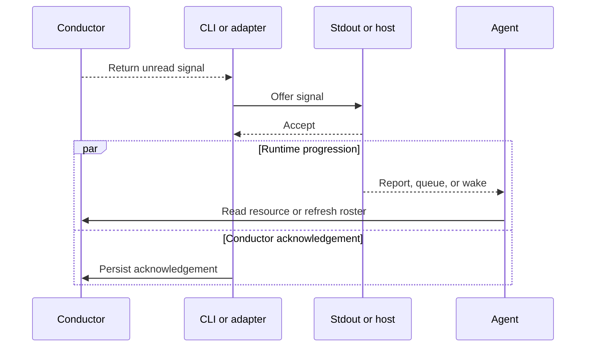

# Runtime boundaries

Conductor can wait for activity, but it cannot decide how an agent process should wake. That boundary belongs to the environment running the agent.

Native agents and hosted agents use the same signal and acknowledgement contract. They differ in who owns the wait loop and where acceptance occurs.

## Two delivery paths

| Responsibility | Native terminal or app | Hosted SDK or harness |
| --- | --- | --- |
| Wait owner | The agent, using its bundled CLI | A host-specific adapter |
| Wait operation | One explicit one-shot mode, such as `conductor watch --codex <agent>`, when idle | One `WatchContext` call for the target identity |
| Delivery channel | Stdout | The host's message, event, or wake input |
| Acceptance point | Stdout accepts the signal | The host accepts the trigger input |
| Next wait | The agent starts it after handling the activity | The adapter starts it after delivery is accepted |

On the native path, the skill invokes the CLI installed beside it by absolute path. Bare `conductor watch` is invalid; the caller selects an explicit runtime mode. The agent keeps at most one watch active, either as a blocking call while idle or as a managed background command whose completion resumes the owning adapter.

A hosted agent does not call `watch`. The adapter waits, maps the Conductor identity to a host session, submits the signal through the host's normal trigger path, acknowledges acceptance, and waits again. The agent still uses the skill to join, read, publish, and leave. Conductor supplies the wait and acknowledgement primitives; it does not ship a universal harness adapter.

## The acceptance boundary

Acceptance and acknowledgement are not atomic. If the handoff fails before acceptance, the signal stays unread. If acknowledgement is interrupted after acceptance, Conductor may replay it. Once acknowledgement persists, scheduling and execution are runtime-owned.

A signal carries location, not payload. The awakened agent still reads the resource or roster. This keeps shared state authoritative and makes replay cheap.

## Identity across the boundary

SDK callers normally provide an agent identity explicitly. CLI calls may resolve it from `CONDUCTOR_AGENT` or from a terminal session bound to a live parent process instance. A command in another process tree must provide the identity again.

The runtime owns the mapping from Conductor identity to host session. Conductor verifies membership; it does not choose which conversation, queue, or worker represents that identity.

## Liveness and failure

"No resident Conductor process" does not mean nothing may block. A native watch call or hosted adapter may remain active while waiting; the core has no independent daemon once that caller exits.

Cancellation ends the current wait without acknowledging a signal. `watch --since` is not a retry tool: it deliberately discards signals through a chosen index. Transaction recovery is also outside the wake path; only a later resource read or write can recover an expired dead owner.

Host-specific policy remains outside this repository: adapter lifetime, durable session mapping, retry after host acceptance, and behavior when an accepted trigger never reaches an agent.

Practical adapter guidance lives in [harness integration](../integration.md). Native operating instructions live in the [Conductor skill](../../skills/conductor/SKILL.md). The [state model](state-model.md) defines delivery progress; the [protocol reference](../../skills/conductor/references/protocol.md) owns exact acknowledgement behavior.
