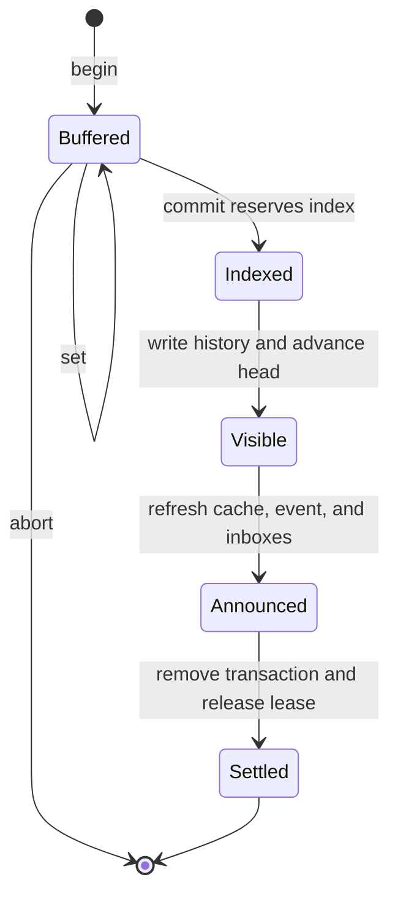

# State model

Conductor's files are coordination state, not a log of an in-memory service. Each operation reads that state, advances it through a guarded transition, and leaves enough evidence for the next operation to continue.

The root `protocol.json` is the compatibility gate for all of that state. Conductor creates it only for an empty root, validates it before constructing operational directories, and revalidates it at every public stateful operation. A nonempty unversioned root and a missing, malformed, or unsupported declaration fail without implicit migration.

## Stable identities

An **agent** is a registered name and responsibility. A terminal binding associates that name with one process instance; an SDK caller may supply identity explicitly. A binding is not membership: every operation still requires the registry entry to exist.

A **resource** is a `<topic-group>/<topic>` name. A **record** is one key within it. One publication may change several keys, but only within one resource.

A **publication index** identifies global reservation order. Completion may occur out of order, and a crash may leave a gap. Timestamps describe events; they do not order publications or signal delivery.

## Membership

Membership follows a short path:

```text
unregistered -> registered -> departed
```

Registration validates the identity, serializes against membership changes, writes the registry entry, returns the current roster and published state, and creates a self-inclusive `join` signal. Repeating the same name and responsibility is idempotent. Reusing the name with a different responsibility is rejected.

Departure removes the registry entry and creates a `leave` signal. It is refused while that agent has an open transaction. Prior publications remain; future signals exclude the departed agent.

## Publication

A coordinated change moves through five meaningful conditions:



`begin` acquires the resource lease and creates a durable transaction. Each `set` updates that transaction and renews the lease. `abort` removes the buffer without making its values visible.

Conditional admission compares supplied per-record indexes with authoritative history while the resource lease is held. Lease acquisition may first complete an earlier dead writer's publication; the rejected request itself creates no transaction or publication state. After admission, conditions are not rechecked; once commit assigns its index, the accepted transaction can only be completed by commit retry or recovery.

`commit` reserves an index, writes immutable history, and advances the resource head. The head transition is the visibility boundary: before it, readers see the previous complete state; after it, they see the new complete state.

Conductor then refreshes record caches, writes an event, appends signals to recipient inboxes, removes the transaction, and releases the lease. A crash after visibility may leave these later steps unfinished. Recovery completes them without creating a second publication.

## Reading and delivery

Three read views share the same published history:

- **Delta** returns changes after the accepted resource-wide or key-specific cursor.
- **Historical** returns an inclusive index range without moving that cursor.
- **Full** reconstructs the current records through the head without moving that cursor.

A signal is a location hint: type, resource, key, index, and publishing agent. One watch returns one unread signal. Explicit acknowledgement advances the signal cursor. Compact acknowledged ranges preserve a late lower index even when a higher one finished first.

`watch --since N` is different. It records an intentional discard floor through `N`; a late signal at or below that index remains discarded.

## Ownership and recovery

Readers may coexist. A writer requires exclusive ownership of the resource.

- With no writer, an eligible operation may proceed.
- An unexpired writer rejects conflicting access as `LOCKED`.
- An expired lease whose process instance is still alive returns `TIMEOUT`; Conductor does not take over or flush it.
- An expired lease whose process instance is dead can be claimed for recovery. A later read or write resumes a matching durable transaction or clears abandoned ownership, then retries its own operation.

Recovery is opportunistic. `watch` consumes existing signals and never recovers resource state.

## Authority on disk

| Concern | Authority | Derived or delivery state |
| --- | --- | --- |
| State compatibility | Root protocol declaration | Installer and version metadata |
| Membership | Registry entries | Terminal session bindings |
| Interrupted write | Transaction and lease | None |
| Published value | Immutable history through head | Record files |
| Created signal | Event with its recipient set | Per-agent inbox entry |
| Accepted progress | Cursor | None |
| Global order | Next-index state | Timestamps |

These distinctions make repair bounded. A stale cache can be rebuilt from history. A missing inbox append can be reconciled from its event. Neither repair changes the publication itself.

Exact file ordering and crash windows belong to the [protocol reference](../../skills/conductor/references/protocol.md). The [architecture](architecture.md) explains why these states exist; [runtime boundaries](runtime-boundaries.md) define when delivery leaves Conductor's responsibility.
