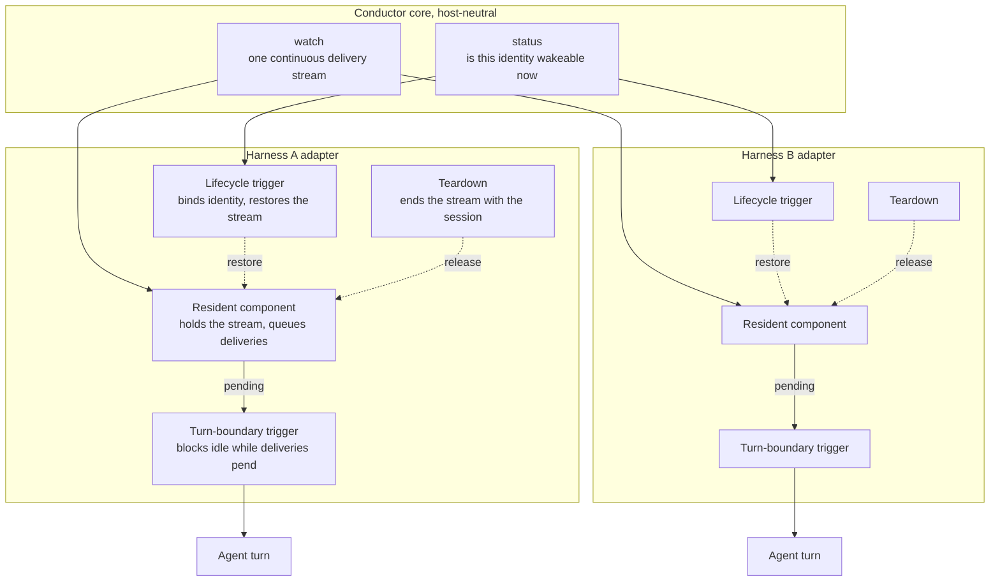

# Wake adapters

## The problem this solves

Reachability and wakeability are different properties, and Conductor currently defends them as one.

**Reachable** means a publication addressed to an agent is not lost: it lands, it persists, and the agent receives it whenever it next looks. **Wakeable** means the arrival of that publication can cause the agent to start a turn, now, with no human involved.

Reachability is sound today. Durable state, persistent cursors, backlog draining, and at-least-once replay all hold. Nothing is lost.

Wakeability is what fails. An agent must start its own watcher, hold the handle in conversational context, and restart it after every signal — and the handle is exactly what a restart, resume, or compaction destroys. The agent is made the guardian of its own reachability, which is the one thing it cannot reliably be. The failure is silent: work arrives, sits correctly, and produces no turn.

## The shape

`watch` becomes a single host-neutral contract: one continuous delivery stream, identical on every host, with no vendor variants and no one-shot semantics.

Everything host-specific — how a delivery becomes a turn, how the connection restores itself — moves out of the core into a per-harness **adapter**. The core stops knowing that vendors exist.

## Requirements

### Conductor core

1. **One watch contract.** `watch` blocks, emits one delivery, acknowledges it as accepted, and continues. It carries no vendor flags; host differences are expressible only in adapters. `--once` ends the stream after one delivery, which is a lifecycle choice belonging to the caller: on a host whose wake primitive is process completion, exiting is how the delivery reaches a turn. The core still cannot tell which host is asking.
2. **Wakeability is queryable.** A cheap, authoritative answer to "is this identity wakeable right now" exists, derived from observable state and never from an agent's recollection.
3. **The roster reports wakeability.** What an operator or agent sees is who would respond to a publication, not who once registered.
4. **The core never decides how a host starts a turn.** That boundary stays outside Conductor.

### Every adapter

5. **Residency is harness-maintained.** The component holding the stream is started and kept alive by the harness itself, not by a tool call the agent has to remember to make.
6. **The adapter owns delivery-to-turn.** It converts an arriving delivery into a real agent turn by whatever means its host provides.
7. **No idle turn while deliveries pend.** An agent cannot finish a turn and go idle while unread team work is waiting for it.
8. **Restoration is blind-safe.** Any number of restore attempts, from any source, converge on exactly one live stream. A redundant attempt is a no-op, never a fault.
9. **Identity binds without the agent.** The adapter resolves which Conductor identity a session represents from configuration, not from a model-supplied argument.
10. **Failure degrades to latency, not loss.** If the immediate-wake path fails, deliveries are still consumed at the next turn boundary.
11. **Residency ends with its session.** When a session ends, its stream ends. An orphaned stream still holds the identity's ownership lock, so leaking one does not merely waste a process — it blocks the next session from arming.

### The agent

12. **Obligations end at joining.** No handle to retain, no re-arm to perform, no vigilance to maintain.

## Responsibilities

Four adapter responsibilities are fixed. Only their realization is host-specific.

| Responsibility | What it guarantees | Realized by whatever the host offers |
| --- | --- | --- |
| Resident component | Requirements 5, 6 | A backgrounded hook process, a host-managed server, a daemonized extension |
| Turn-boundary trigger | Requirement 7 | A turn-completion hook, an interceptor, a host callback |
| Lifecycle trigger | Requirements 8, 9 | A session-start or context-reset hook, an activation event |
| Teardown | Requirement 11 | A session-end hook, a shutdown callback, a process-group death |

An adapter is one installable unit per harness — a plugin, an extension, or whatever that host packages such things as. It is not a hook alone; a hook is one of the four parts inside it.

Requirement 10 is what makes the resident component and the turn-boundary trigger worth building independently of any immediate-wake path. Together they guarantee consumption. An immediate-wake path, where a host offers one, only makes it fast.

## What the core exposes

`watch` is the stream. `status` is the wakeability query: it reports whether an identity is on the roster and whether a live process currently holds its ownership guard, derived from the guard's owner record and the operating system's own view of that process. It never acquires the guard, because a status check that could momentarily block a live stream would be a way to cause the failure it exists to detect; and it never trusts a claim to be watching, because that claim is exactly what goes stale when a stream dies silently.

Both are host-neutral. The adapter subtree is where host knowledge lives, and it reaches the bus through the same public client any other caller would use — the direction of the dependency is the whole point, and it is the inverse of the vendor `watch` flags this design replaced.

## First instance: Claude

Packaged as a plugin — `.claude-plugin/plugin.json` with `hooks/hooks.json` beside it, and an optional `.mcp.json`. It lives at [`adapters/claude-code/`](../../adapters/claude-code/README.md); its host-specific logic is `conductor adapter claude <arm|release|identity>`.

| Responsibility | Realization |
| --- | --- |
| Resident component | A background hook running `watch`, marked `asyncRewake`. It blocks on the stream and exits 2 when a delivery arrives; its output reaches the model as a system reminder, and this wakes an idle session with no active turn. |
| Turn-boundary trigger | A `Stop` hook, itself `asyncRewake`, so arming and residency are one hook: it backgrounds without blocking the turn, and every turn end re-arms. |
| Lifecycle trigger | A `SessionStart` hook matching `startup`, `resume`, `clear`, `compact`, and `fork`. Arms the resident component and re-announces state. |
| Teardown | A `SessionEnd` hook. The host awaits outstanding rewake hooks while tearing a session down, so a stream that ignores session end delays the host's own exit. |

Three findings shape this:

**No model participation is required at any point.** The host arms the watcher, the host wakes the session, the host re-arms after each wake. Requirement 11 is satisfied outright rather than approximated.

**The resident component is a hook process, not the MCP server.** Server-initiated turns do exist in this host, but through a gated preview path; and a stdio MCP server is not restarted automatically if it dies, whereas a hook is re-armed by the next lifecycle or turn-boundary event. The MCP server therefore carries no wake responsibility. Its value is ergonomic — Conductor's operations as typed tools instead of shell invocations by absolute path — and the adapter is correct without it.

**Wake and re-arm form a closed cycle.** A delivery wakes the session; the resulting turn ends; the turn-boundary trigger arms the next watcher. Session start, resume, and compaction enter the same cycle. Every path that loses a watcher has an event that restores it.

Where a host offers a first-class push channel, the resident component can adopt it in place of the exit-code wake without disturbing the other two responsibilities. Treat it as a swappable accelerator, not a dependency: on this host that path is a research preview requiring a launch flag, an allowlist, and a specific authentication backend, so it cannot carry a production guarantee.

### Verified

The capability the design stands on — that exiting 2 from a backgrounded hook starts a turn in a session sitting idle — has been observed, in isolation with no Conductor in the loop. An idle session woke, took a real turn, and read the hook's output; the `Stop` hook armed the successor at turn end; a second delivery woke it again. Three arms, two wakes, no human input. The run is recorded in [verified wake methods](../integrations/verified-wake-methods.md).

That result also confirms the arrangement rather than just the mechanism. Because one process wakes at most once, and because outstanding hooks are drained at session teardown rather than at turn end, the resident component and the turn-boundary trigger collapse into a single `asyncRewake` `Stop` hook — the successor is armed by the event that ends the woken turn, not by the process that fired.

A third finding was not anticipated and matters more than either: **a resident component may have a lifetime imposed by its host, and may lose it silently.** On this host the stream is killed at its hook's configured timeout, running no exit path, emitting no wake, while the session sits idle with no event due to re-arm it. A resident component is therefore not something an adapter starts and forgets; its lifetime is a property the adapter must know, extend where the host allows, and survive the loss of where it does not.

This is what requirement 10 is for, and the run turned it from prudence into necessity. The turn-boundary trigger is not a backstop for a flaky wake path — the wake path is reliable. It is the backstop for a resident component that can vanish without saying so.

Still open: the consecutive-block cap on turn-boundary blocking and how the adapter reports work it cannot drain within it; whether the lifecycle trigger behaves the same on `resume`, `clear`, `compact`, and `fork` as it does on `startup`; and whether a wake can land in a session other than the one that armed it.

## Not yet built

Requirement 3 — the roster reporting wakeability — is not implemented. `status` answers for one identity; `list-agents` still reports who registered, not who would respond. Closing the gap means resolving each roster entry's guard at listing time, and deciding whether wakeability belongs on the wire type or beside it.

Installation does not yet register host configuration. `conductor install` places the skill and the executable; putting the plugin where the host loads it, and the executable inside the plugin, is a documented manual step in [the adapter's README](../../adapters/claude-code/README.md).

## Consequences

- The vendor variants of `watch` are removed from the CLI surface; the integration matrix becomes a list of adapters rather than a table of commands.
- Installation grows a new responsibility: registering host configuration, not only placing a skill directory and an executable.
- Identity binding becomes configuration a session carries, rather than an argument a model supplies per command. On this host it must be a project-owned file the adapter reads itself: plugin-level user configuration is deliberately not readable from project settings, so it cannot vary per project.
