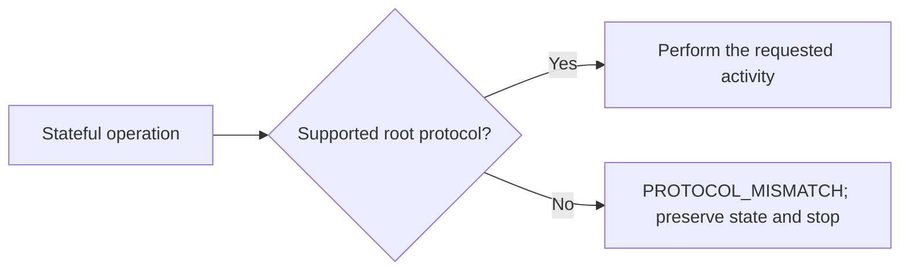
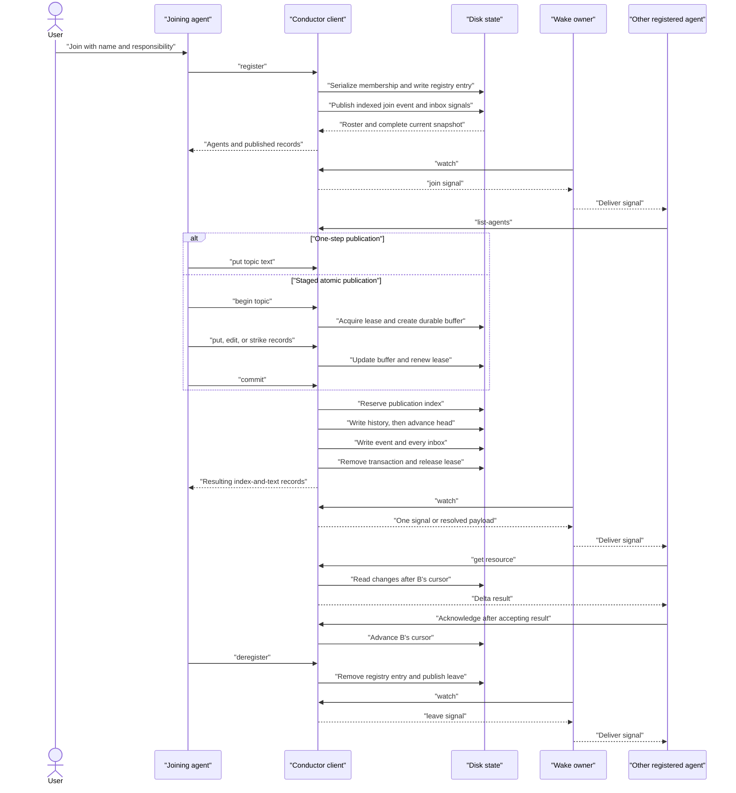
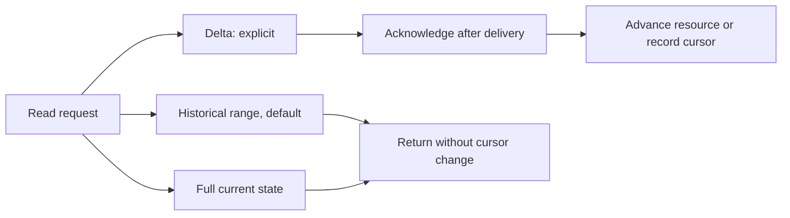
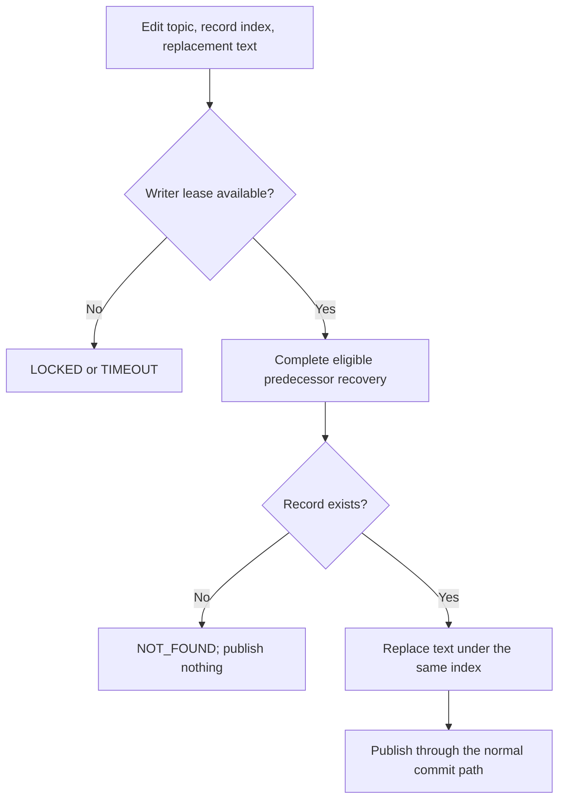
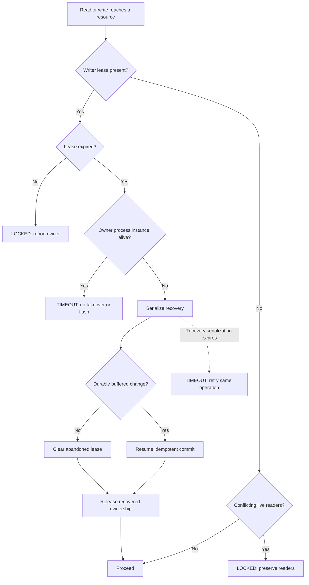
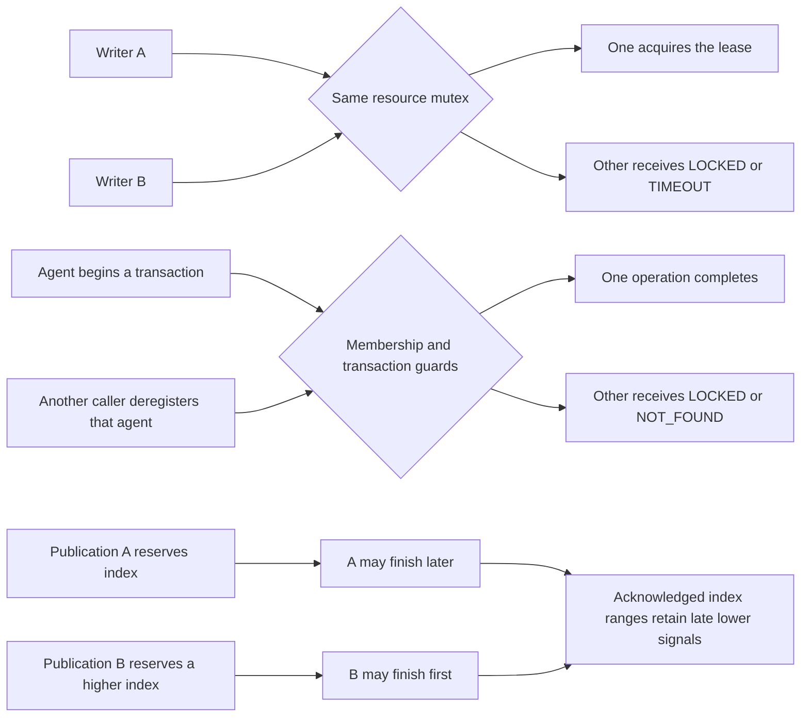
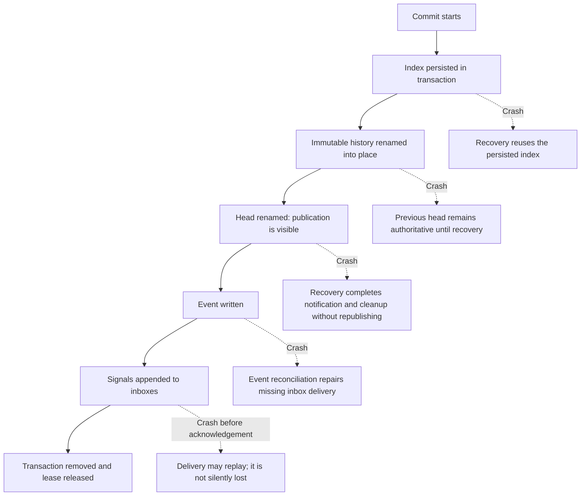

# Conductor activity diagrams

These diagrams cover the agent-visible lifecycle and the ordering that matters during normal work, contention, timeout, and crash recovery. Storage details are defined by the [protocol reference](../skills/conductor/references/protocol.md).

## Happy path

Every stateful path first crosses the same compatibility gate:

The wake owner is either the receiving agent or a harness adapter acting for it.

The alternative read modes do not move the delta cursor:

An unfinished staged change may be cancelled with `abort`; its buffered values never become visible.

Editing a record preserves its identity:

## Timing, races, and timeouts

Concurrent operations are resolved at their owning serialization boundary:

## Crash boundaries

Recovery is opportunistic: a later read or write triggers it after lease expiry. `watch` only consumes signals and does not recover an interrupted resource transaction. `watch --since <index>` deliberately discards that index and all lower signal indexes, including a lower index that arrives late.
